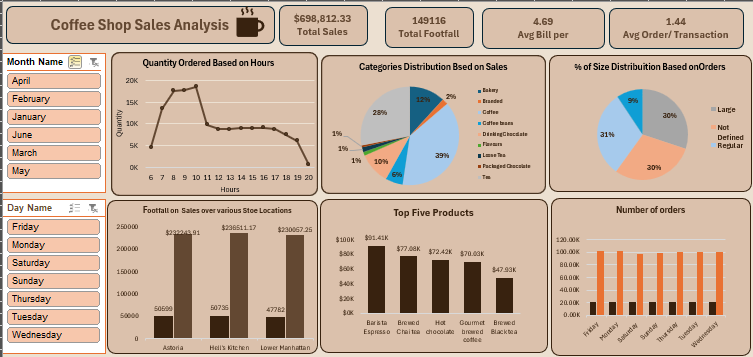

# Coffee_Sales_Excel_DB
Welcome to the Coffee Shop Sales Analysis repository! In this project, we delve into coffee shop sales data using Microsoft Excel. Our analysis covers various aspects, including sales patterns, peak hours, store locations, and top-selling products. We leverage powerful Excel features to gain insights and visualize trends.

## Features Used
1. MS Excel: The cornerstone for data organization and manipulation. 
2. Power Query: Ensures clean and transformed data. 
3. Power Pivot: Enables data modeling and measure calculations. 
4. Pivot Tables: Summarizes and filters top-performing data. 
5. Charts & Graphs: Visualizes trends for better understanding. 
6. Slicers: Enhances visualization interactivity. 
## Key Insights
### 1. Sales by Day and Hour 
Peak sales occur on Mondays, Thursdays, and Fridays during the morning hours (9 am to 10 am). Identifying these peak times helps optimize staffing and inventory management. 
### 2. Store Locations  
Astoria: Total sales of $232,243.91  
Hell's Kitchen: Total sales of $236,511.17  
Lower Manhattan: Total sales of $230,057.25  

Understanding location-specific performance is crucial for expansion and resource allocation.

### 3. Average Price/Order per Person
The average bill per customer is $4.69. Monitoring this metric ensures pricing strategies align with customer expectations.
### 4. Top-Selling Products
##### Our top-selling products include:

Barista Espresso 
Brewed Black Tea 
Brewed Chai Tea 
Government Brewed Coffee 
Hot Chocolate 
Focusing on these products can significantly boost revenue.

## Key Takeaways
Optimize Staffing: Staffing during peak hours is critical. Ensure adequate coverage during busy times. 
Location-Specific Strategies: Tailor marketing efforts based on the performance of each store location. 
Regular Review: Continuously review pricing and product performance to stay competitive.  
Note: This analysis was conducted as part of a project and is for educational purposes only.
